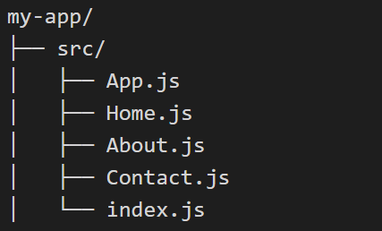

## react-router-dom

`react-router-dom` est une bibliothèque de routage pour les applications React. Elle permet de créer des applications à page unique (SPA) avec une navigation dynamique sans recharger la page. Elle gère les URL et rend les composants en fonction du chemin de l'URL.

### Installation

Pour utiliser `react-router-dom`, vous devez d'abord l'installer via npm ou yarn :

`npm install react-router-dom`

ou

`yarn add react-router-dom`

### Concepts de base

1. **BrowserRouter** : Le composant de haut niveau qui englobe votre application et permet l'utilisation de l'historique du navigateur.
2. **Routes** : Un conteneur pour les routes individuelles.
3. **Route** : Un composant qui rend un composant en fonction du chemin de l'URL.
4. **Link** : Un composant pour créer des liens de navigation sans recharger la page.

### Exemple simple

#### Structure du projet



#### Code

**src/index.js**

```
import React from 'react';
import ReactDOM from 'react-dom';
import App from './App';

ReactDOM.render(<App />, document.getElementById('root'));
```

**src/App.js**

```
import React from 'react';
import { BrowserRouter as Router, Routes, Route, Link } from 'react-router-dom';
import Home from './Home';
import About from './About';
import Contact from './Contact';

function App() {
  return (
    <Router>
      <div>
        <nav>
          <ul>
            <li>
              <Link to="/">Home</Link>
            </li>
            <li>
              <Link to="/about">About</Link>
            </li>
            <li>
              <Link to="/contact">Contact</Link>
            </li>
          </ul>
        </nav>

        <Routes>
          <Route path="/" element={<Home />} />
          <Route path="/about" element={<About />} />
          <Route path="/contact" element={<Contact />} />
        </Routes>
      </div>
    </Router>
  );
}

export default App;
```

**src/Home.js**

```
import React from 'react';

function Home() {
  return `<h2>`Home`</h2>`;
}

export default Home;
```

**src/About.js**

```
import React from 'react';

function About() {
  return <h2>About</h2>;
}

export default About;
```

**src/Contact.js**

```
import React from 'react';

function Contact() {
  return <h2>Contact</h2>;
}

export default Contact;
```

### Explication

1. **BrowserRouter** : Le composant `Router` englobe toute l'application, permettant l'utilisation de l'historique du navigateur.
2. **Link** : Les composants `Link` sont utilisés pour créer des liens de navigation sans recharger la page.
3. **Routes et Route** : Le composant `Routes` contient plusieurs `Route`. Chaque `Route` rend un composant en fonction du chemin de l'URL.
